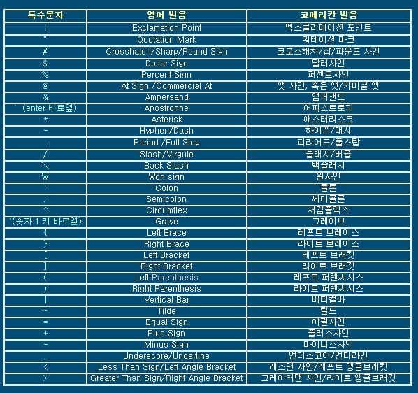

# git-bash 용어 익히기

 ### ***경로이동***

1.  상위폴더로 이동               **cd ..** 
2.  지정이동                           cd 폴더명칭    
3.  최상단이동                       cd ~
4.  경로 확인                          pwd
5.  드라이브이동                    cd ?:
6.  지정폴더 하위폴더 이동  cd 폴더/하위폴더

### ***생성/삭제***

1. 폴더생성                           mkdir
2. 파일생성                           touch
3. 강제삭제                           rm -r

### ***기타***

1. 리스트 확인                      ls
2. 화면정리                           clear
3. 명령어 전환                      &&

## tip: 키보드 명칭체크

